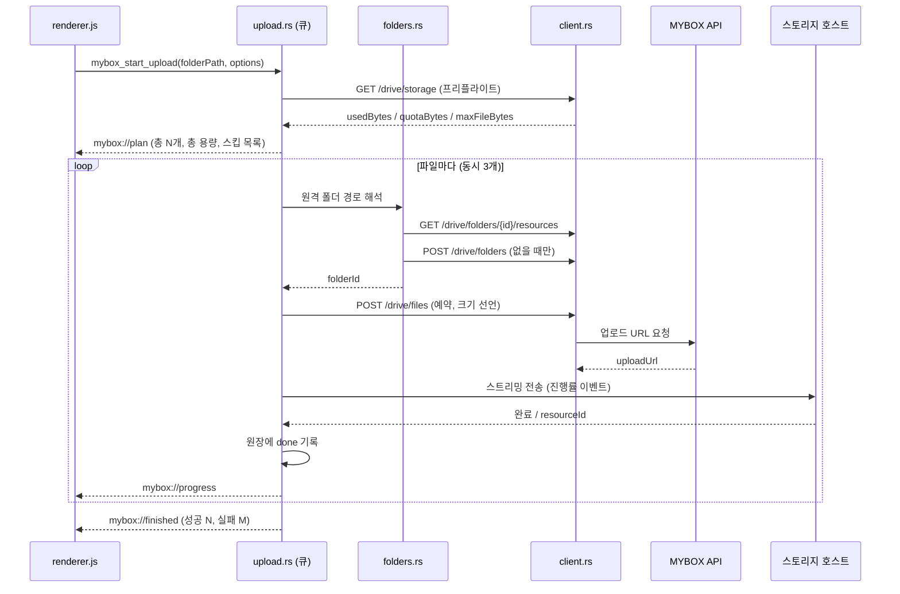

# MyBox 업로드 기능 설계

리네임이 끝난 사진/동영상을 앱에서 바로 NAVER MYBOX로 올리기 위한 설계 문서.
구현 전 합의용이며, 코드는 아직 없다.

---

## 0. 먼저 읽을 것 — 스펙 신뢰도

이 문서를 쓴 환경에서 `developers.mybox.naver.com` 에 직접 접속하지 못했다
(에이전시 프록시가 `*.naver.com` 에 대한 CONNECT 를 403으로 거부).
따라서 **아래 1장의 API 요약은 공식 문서 원문이 아니라, MYBOX Open API 를 감싼
공개 서드파티 SDK(`minhyung/mybox` / `overworks/php-mybox`)의 설명에서 재구성한 것**이다.

- 엔드포인트 목록과 3단계 업로드 구조 같은 **큰 골격은 신뢰할 만하다.**
- 요청/응답의 **정확한 필드명, 헤더, 상태 코드는 검증되지 않았다.**
- 그래서 이 설계는 "HTTP 와이어 포맷을 파일 하나(`client.rs`)에 가두는" 구조를 택했다.
  공식 문서와 다른 부분이 나와도 고칠 범위가 그 파일로 한정된다.

구현 착수 전 반드시 [8장 공식 문서 대조 체크리스트](#8-공식-문서-대조-체크리스트)를 먼저 확인할 것.

---

## 1. 재구성한 MYBOX Open API 요약

**Base URL**: `https://open-api.mybox.naver.com/v1`

> 실측으로 확인. 처음 재구성한 `api.mybox.naver.com` 은 MyBox **웹 서비스** 호스트라
> `/v1/drive/storage` 에 HTML 페이지를 404 로 돌려준다. Open API 는 `open-api.` 서브도메인에 있다.

**인증**: 개인용 액세스 토큰(PAT) — `Authorization: Bearer <PAT>` (실측 확인)
- MYBOX 웹 설정에서 사용자가 직접 발급
- 만료 30 / 60 / 90 / 180일 선택, 계정당 최대 5개
- 스코프 구분 없이 **드라이브 전체 접근** — 사실상 비밀번호와 동일한 취급 필요
- 별도 OAuth 앱 등록 절차는 확인되지 않음

**공개 엔드포인트 20개**

| 분류 | 엔드포인트 |
|---|---|
| 드라이브 | `GET/PATCH /drive/storage`, `GET /drive/resources`, `GET /drive/folders/{folderId}/resources`, `GET /drive/resources/{resourceId}`, `POST /drive/resources/{resourceId}/favorite` · `/unfavorite` |
| 파일/폴더 | `POST /drive/folders`, `POST /drive/files`, `GET /drive/files/{fileId}/download`, `POST /drive/resources/{resourceId}/copy` · `/move` · `/rename`, `DELETE /drive/resources/{resourceId}` |
| 검색 | `GET /search/resources/files`, `GET /search/resources/folders` |
| 휴지통 | `GET /drive/trash`, `POST /drive/trash/{resourceId}/restore`, `DELETE /drive/trash/{resourceId}`, `DELETE /drive/trash` |

**업로드는 3단계**

1. **예약** — `POST /drive/files` → 업로드 URL 발급. 파일 크기를 정확히 선언해야 하고,
   실제 전송 바이트 수가 선언값과 정확히 일치해야 한다.
2. **전송** — 1단계에서 받은 **별도 스토리지 호스트**로 바이트 전송.
3. **재개(resume)** 지원. 시각 값은 KST 기준.

**용량 정보**: `GET /drive/storage` → `usedBytes`, `quotaBytes`, `maxFileBytes` (실측 확인)

`maxFileBytes` 는 실제 계정에서 **50GB** 로 나왔다. 이 조사에서 다루는 RAW·동영상은
여기 걸릴 일이 거의 없으므로, 프리플라이트의 파일 크기 스킵은 예외 처리 수준으로 두면 된다.

**목록/검색**: `sortBy` · `sortOrder` · `count`(1~1000), 커서 페이지네이션.
검색은 `q` / `category` / 날짜 범위 중 최소 하나 필수, 페이지 20~200.

---

## 2. 핵심 설계 결정

### 2-1. 리네임 직후 자동 업로드가 아니라, **폴더 단위 일괄 업로드**

이 앱의 작업 흐름은 Enter로 한 장씩 넘기면서 이름을 붙이고, 방향키로 **되돌아가서 고치는** 것이다
(`parseExistingFilename()` 이 존재하는 이유 자체가 재방문 수정이다).

파일별 즉시 업로드를 하면:
- 잘못된 이름이 MYBOX에 먼저 올라가고, 수정할 때마다 `/rename` 을 다시 호출해야 한다
- 원격 상태와 로컬 상태를 계속 동기화해야 해서 실패 경우의 수가 폭증한다

따라서 **기본 동작은 "정리가 끝난 폴더를 통째로 업로드"** 로 한다.
Enter 키 흐름은 지금 그대로 두고, 업로드는 명시적 버튼으로 시작한다.
(파일별 즉시 업로드는 설정에서 켤 수 있는 옵션으로 남겨두되 1차 구현 범위 밖)

### 2-2. HTTP는 전부 Rust에서, 토큰은 웹뷰에 절대 내려보내지 않는다

- `tauri.conf.json` 의 CSP 는 `default-src 'self' ipc:` 로 잠겨 있다. 네트워킹을 Rust에 두면 **CSP를 손댈 필요가 없다.**
- 토큰은 OS 키체인에만 저장하고, 프론트에는 "설정됨 / 마스킹된 꼬리 4자 / 만료일" 만 반환한다.
- 웹뷰가 오염돼도 토큰이 유출되지 않는다. 기존 `validate_file_name()` 과 같은 심층 방어 기조를 잇는다.

### 2-3. 대용량 파일은 스트리밍 전송

`suggest_species` 는 이미지를 base64로 통째 메모리에 올리지만, 업로드에는 절대 그렇게 하면 안 된다.

- RAW 한 장이 25~80MB, 동영상은 GB 단위
- `reqwest::Body::wrap_stream(ReaderStream::new(File))` 로 스트리밍
- `Content-Length` 는 파일 크기와 정확히 일치 (API가 정확 일치를 요구)
- 진행률은 스트림을 감싸 전송 바이트를 세면서 산출

### 2-4. 업로드 원장(ledger)으로 멱등성 확보

앱이 죽거나 네트워크가 끊겨도 다시 처음부터 올리지 않도록, 폴더별 업로드 원장을 남긴다.

`app_config_dir/mybox/ledger/<폴더경로 해시>.json`

```json
{
  "folderPath": "/Volumes/SD_CARD/2024-08-15",
  "remoteRoot": "/어류조사",
  "updatedAt": "2024-08-16T09:12:03+09:00",
  "entries": {
    "IMG_1234_돌돔_남애북바위N_홍길동_20240815.jpg": {
      "size": 8123456,
      "mtimeMs": 1723712345000,
      "status": "done",
      "resourceId": "abc123",
      "remotePath": "/어류조사/20240815/남애북바위N/IMG_1234_...jpg",
      "uploadedAt": "2024-08-16T09:11:58+09:00",
      "attempts": 1
    }
  }
}
```

- 상태: `pending` / `uploading` / `done` / `failed` / `skipped`
- 재실행 시 `status=done` 이고 `size`·`mtimeMs` 가 그대로면 건너뛴다
- 파일명이 바뀌면 새 엔트리가 된다. **이미 올라간 파일을 나중에 리네임하면 MYBOX에는 중복이 생긴다** —
  그래서 2-1의 "정리 완료 후 업로드" 원칙이 중요하다. UI에서도 이 점을 경고한다.

---

## 3. 원격 폴더 구조

로컬 파일명이 이미 모든 메타데이터를 담고 있으므로, 원격 폴더는 **찾기 쉬운 축**으로만 나눈다.

기본 템플릿:

```
{루트}/{촬영일자}/{지역접두사+포인트명}
```

예: `/어류조사/20240815/남애북바위N/IMG_1234_돌돔_남애북바위N_홍길동_20240815.jpg`

- 루트 기본값 `/어류조사`, 설정에서 변경 가능
- 템플릿 토큰: `{root}` `{shootDate}` `{point}` `{photographer}` `{yyyy}` `{mm}` `{dd}`
- `defaults.json` 에 `myboxRemoteTemplate` 로 저장 (기존 defaults 저장 경로 재사용)
- 파일명에서 날짜/포인트를 파싱하지 못하면 `{루트}/_미분류/` 로 보낸다

**폴더 ID 해석**: MYBOX는 경로가 아니라 `folderId` 로 동작한다.

1. 경로를 세그먼트로 쪼갠다
2. 세그먼트마다 `GET /drive/folders/{parentId}/resources` 로 같은 이름의 폴더를 찾는다
3. 없으면 `POST /drive/folders` 로 만든다
4. `(parentId, 이름) → folderId` 를 메모리 + `app_config_dir/mybox/folder_cache.json` 에 캐시

동시 업로드 중 같은 폴더를 두 태스크가 만들려 할 수 있으므로, 폴더 해석은 **뮤텍스로 직렬화**하고
생성 실패(중복) 시 한 번 재조회한다.

> 경로 기반 조회 API가 존재하면 이 세그먼트 순회는 통째로 없앨 수 있다 → 체크리스트 #6

---

## 4. 업로드 파이프라인



### 동시성

- `tokio::sync::Semaphore`, 기본 3 (설정 1~5)
- 자연 정렬 순서로 투입 — 사용자가 예상하는 순서대로 진행 표시
- 취소는 `tokio_util::sync::CancellationToken`

### 재시도

지수 백오프 2s → 4s → 8s → 16s, 최대 4회. (기존 프로젝트의 git push 재시도 정책과 동일한 감각)

| 상황 | 처리 |
|---|---|
| 네트워크 오류 / 타임아웃 | 재시도 |
| 5xx | 재시도 |
| 429 | `Retry-After` 존중, 그 값만큼 대기 후 재시도 |
| 401 / 403 | **재시도 안 함.** 큐 전체 중단, "토큰 만료/무효" 상태로 전환 |
| 413 / 용량 초과 | 재시도 안 함, 해당 파일 `skipped` |
| 409 (이름 충돌) | 재시도 안 함, 정책에 따라 처리 (→ 체크리스트 #4) |

재개(resume)를 지원하면, 재시도 시 처음부터가 아니라 전송된 오프셋부터 이어 보낸다.
1차 구현은 "처음부터 재전송", 재개 프로토콜 확인 후 5단계에서 최적화.

### 프리플라이트 검사

큐 시작 전에 한 번:
- `GET /drive/storage` 의 `quotaBytes - usedBytes` < 업로드 총 용량 → 시작 전 경고 다이얼로그
- `maxFileBytes` 초과 파일 → 목록으로 보여주고 `skipped` 처리 (동영상에서 걸릴 가능성이 높다)

### 진행률 이벤트

Tauri 이벤트로 발행. **200ms 또는 1% 단위로 throttle** 해서 IPC 폭주를 막는다.

| 이벤트 | payload |
|---|---|
| `mybox://plan` | `{ total, totalBytes, skipped: [{ name, reason }] }` |
| `mybox://progress` | `{ fileName, sentBytes, totalBytes, index, total }` |
| `mybox://file-done` | `{ fileName, resourceId, remotePath }` |
| `mybox://file-failed` | `{ fileName, error, willRetry }` |
| `mybox://finished` | `{ succeeded, failed, skipped, cancelled }` |

---

## 5. 새 Tauri 커맨드

| 커맨드 | 인자 | 반환 | 설명 |
|---|---|---|---|
| `mybox_set_token` | `token` | `Result<TokenStatus>` | 키체인 저장 + `GET /drive/storage` 1회로 유효성 검증 |
| `mybox_clear_token` | — | `Result<()>` | 키체인에서 삭제 |
| `mybox_token_status` | — | `TokenStatus` | `{ configured, maskedTail, lastVerifiedAt, invalid }` — **토큰 원문은 절대 반환하지 않음** |
| `mybox_get_quota` | — | `Result<Quota>` | `{ usedBytes, quotaBytes, maxFileBytes }` |
| `mybox_plan_upload` | `folderPath`, `template` | `Result<UploadPlan>` | dry-run. 올릴 파일 / 원격 경로 / 스킵 사유 미리보기 |
| `mybox_start_upload` | `folderPath`, `options` | `Result<()>` | 큐 시작. 진행 상황은 이벤트로 |
| `mybox_cancel_upload` | — | `Result<()>` | 진행 중 취소 (전송 중인 파일은 중단, 완료분은 원장 유지) |
| `mybox_upload_status` | — | `UploadSnapshot` | 창을 다시 열었을 때 현재 상태 복원용 |
| `mybox_retry_failed` | `folderPath` | `Result<()>` | 원장에서 `failed` 인 것만 다시 큐잉 |

`mybox_plan_upload` 를 **먼저 보여주고 사용자가 확인한 뒤 시작**하는 흐름을 권장한다.
클라우드에 잘못된 폴더 구조를 만드는 사고를 막는 가장 싼 방법이다.

---

## 6. 코드 구조

`lib.rs` 가 이미 763줄이므로 업로드는 모듈로 분리한다.

```
src-tauri/src/
├── lib.rs              기존 커맨드 + mybox 커맨드 등록만 추가
└── mybox/
    ├── mod.rs          Tauri 커맨드 표면, 타입 정의
    ├── client.rs       ★ HTTP 와이어 포맷 — 공식 스펙에 의존하는 유일한 파일
    ├── token.rs        키체인 저장/조회, 마스킹
    ├── folders.rs      원격 경로 → folderId 해석 + 캐시
    ├── upload.rs       큐, 동시성, 재시도, 진행률 이벤트
    └── ledger.rs       업로드 원장 읽기/쓰기
```

**추가 의존성**

```toml
keyring = "3"                                          # macOS Keychain / Windows Credential Manager
tokio-util = { version = "1", features = ["io"] }      # ReaderStream
futures-util = "0.3"                                   # 스트림 진행률 래핑
# reqwest 에 "stream" feature 추가 필요
```

`reqwest` / `tokio` / `serde` 는 이미 있다.

---

## 7. UI 변경

- **헤더**: `MyBox 업로드` 버튼 + 설정(톱니) 아이콘 추가
- **설정 모달**: 토큰 입력(`type=password`, 발급 방법 안내 링크), 원격 루트 경로, 폴더 템플릿, 동시 업로드 수, 현재 용량 표시
- **업로드 패널**(하단 드로어): 전체 진행 바, 파일별 상태 리스트, `실패만 재시도` 버튼
- **상태바**: `업로드 12/128 · 실패 1` 요약. 기존 `statusLeft`/`statusRight` 패턴 재사용
- **시작 전 확인 화면**: `mybox_plan_upload` 결과 — "128개 / 4.2GB 를 `/어류조사/20240815/남애북바위N` 에 올립니다" + 스킵 목록
- CSP 변경 없음 (모든 HTTP는 Rust에서)

---

## 8. 공식 문서 대조 체크리스트

구현 착수 전 `https://developers.mybox.naver.com/` 에서 확인할 것.
확인 결과에 따라 위 설계가 바뀔 수 있는 항목들이다.

1. ~~**API 주소**~~ — ✅ `https://open-api.mybox.naver.com/v1`
2. ~~**인증 헤더 형식**~~ — ✅ `Authorization: Bearer <PAT>`.
   PAT 외에 앱 등록 기반 OAuth 2.0 플로우가 따로 있는지는 아직 미확인
   (있다면 여러 사용자 배포에는 그쪽이 맞다)
3. **`POST /drive/files` 요청 바디** — 필드명(`parentFolderId`? `name`? `size`?), 필수/선택 구분
4. **업로드 URL 응답** — 필드명, 유효기간, 전송 메서드(PUT/POST), `Content-Type`, 청크 분할 필요 여부
5. **동일 이름 존재 시 동작** — 덮어쓰기 / 자동 리네임 / 409 중 무엇인가.
   재실행 시 중복 생성을 막는 정책이 여기서 갈린다
6. **재개(resume) 프로토콜** — 오프셋 조회 방법, `Range`/`Content-Range` 헤더 규격
7. **경로 기반 폴더 조회 API 유무** — 있으면 3장의 세그먼트 순회를 통째로 제거 가능
8. **Rate limit** — 분/일 단위 호출 제한, 429 응답 형식과 `Retry-After`.
   동시 업로드 수 기본값을 여기 맞춰 정한다
9. ~~**`maxFileBytes`**~~ — ✅ 50GB. 다만 **파일 타입 제한**(동영상/RAW 확장자 거부 여부)은 미확인
10. **한글 파일명 인코딩 — NFC vs NFD** ⚠️
   macOS는 파일명을 **NFD**(자소 분리)로 저장한다. `돌돔` 이 `ㄷㅗㄹㄷㅗㅁ` 형태로 전송되면
   MYBOX 웹/앱에서 깨져 보이거나 검색이 안 될 수 있다.
   **전송 전 NFC 정규화를 넣는 것을 기본으로 하되, 실제 동작을 반드시 확인할 것.**
   (`unicode-normalization` 크레이트 필요. 이 앱은 파일명이 전부 한글이라 영향이 크다)
11. **타임존** — `modifiedTime` 등 시각 값이 KST 고정인지, ISO8601 오프셋을 받는지

---

## 9. 단계별 구현 계획

| 단계 | 내용 | 검증 포인트 |
|---|---|---|
| 1 | ✅ **구현 완료** — 토큰 저장/검증 + 용량 조회 (`token.rs`, `client.rs` 최소분, 설정 모달) | 가장 얇은 수직 슬라이스로 **인증 방식과 base URL을 실제로 검증**한다 |
| 2 | 폴더 경로 해석/생성 + 단일 파일 스트리밍 업로드 | 업로드 3단계 실제 동작, 한글 폴더명/파일명 인코딩 |
| 3 | 큐 · 동시성 · 진행률 이벤트 · 취소 | IPC 이벤트 부하, 대용량 파일 메모리 사용량 |
| 4 | 원장 기반 재개 + 실패 재시도 + `plan` 미리보기 UI | 앱 강제 종료 후 재시작 시 중복 업로드 없는지 |
| 5 | resume 프로토콜, 429 처리, 용량 프리플라이트 정교화 | 실사용 규모(수백 장 / 수 GB) 테스트 |

1단계는 하루면 끝나고, 여기서 8장 체크리스트의 절반이 실측으로 해결된다.
**1단계를 먼저 돌려보고 나머지 설계를 확정하는 것을 권한다.**

### 1단계 구현 메모

`src-tauri/src/mybox/` 에 구현했다. 확인된 것과 아직 확인되지 않은 것은 다음과 같다.

로컬 목 서버로 검증한 것 (`client.rs` 의 테스트):
- `Authorization: Bearer <PAT>` 헤더를 담아 `GET {base}/drive/storage` 를 호출한다
- 401 을 토큰 만료 안내로, 파싱 실패를 응답 원문과 함께 보고한다
- `usedBytes` 등이 `data` / `result` / `storage` 래퍼 안에 있어도 찾아낸다

**실제 MYBOX 서버로 확인 완료.** `GET /drive/storage` 가 200 과 함께
`usedBytes` / `quotaBytes` / `maxFileBytes` 를 돌려줬다 (173GB / 2.0TB, 파일 최대 50GB).
체크리스트 #1(주소), #2(인증 헤더), #8 일부가 해소됐다.

가는 길에 하나 배웠다: 처음 재구성한 `api.mybox.naver.com` 은 MyBox **웹 서비스**
호스트라 `/v1/drive/storage` 에 `<title>Drive</title>` 인 HTML 을 404 로 돌려준다.
그래서 응답이 HTML 이면 "엔드포인트 없음"이 아니라 "이 주소는 API 가 아님"으로 안내한다.

주소가 틀렸을 때를 위해 남겨둔 장치들:
- **API 주소를 앱에서 바꿀 수 있다** (설정 → 고급 설정). 재빌드 없이 바로잡을 수 있다
- **성공/실패 모두 응답 원문을 화면에 보여준다** (설정 창의 "응답 원문(진단용)")
- 용량 필드를 못 찾으면 그 사실을 명시적으로 안내한다

즉 실제 토큰으로 한 번 눌러보면 체크리스트 #1(인증 헤더), #2 일부(주소·응답 구조)가
바로 판정된다. 결과를 보고 `client.rs` 를 고치면 된다.

---

## 10. 남은 위험 요소

- **PAT 만료(최대 180일)** — 어류반 사용자들이 주기적으로 재발급해야 한다.
  만료 임박(7일 이내) 시 앱에서 미리 안내하는 UI가 필요하다.
- **PAT = 드라이브 전체 권한** — 스코프를 좁힐 수 없다면, 앱이 삭제 계열 API를
  아예 호출하지 않는다는 점을 문서/도움말에 명시하는 편이 낫다.
- **여러 명이 같은 계정을 쓰는 경우** 토큰 5개 제한에 걸릴 수 있다.
- **SD카드 직접 업로드** — 카드 리더 전송 속도가 병목이 될 수 있으니 동시 업로드 수를
  무작정 올리지 말 것.
