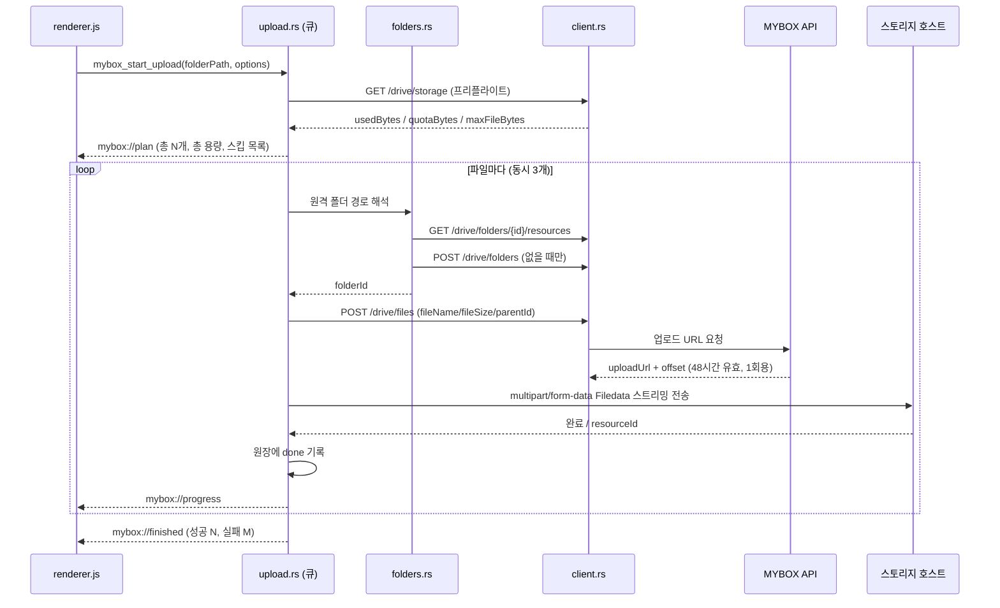

# MyBox 업로드 기능 설계

리네임이 끝난 사진/동영상을 앱에서 바로 NAVER MYBOX로 올리기 위한 설계 문서.
구현 전 합의용이며, 코드는 아직 없다.

---

## 0. 문서 상태

> **현재 MyBox 연동 UI 는 기본으로 숨겨져 있다.** 2-5 의 공유 폴더 제약 때문에
> 반 운영 방식이 정해지기 전까지 일반 사용자에게 노출하지 않는다.
> 앱 제목을 Shift+클릭하면 켜고 끌 수 있다 (`localStorage` 의 `myboxVisible`).

**1장의 API 스펙은 공식 문서(<https://developers.mybox.naver.com/>)를 직접 확인한 내용이다.**

초안은 공식 문서에 접근하지 못한 상태에서 서드파티 SDK 설명으로 재구성했고, 그때
`api.mybox.naver.com` 을 base URL 로 잡았다가 틀렸다 (그 호스트는 MyBox **웹 서비스**라
`<title>Drive</title>` 인 HTML 을 404 로 돌려준다). 실제 Open API 는
`open-api.mybox.naver.com` 이다. 그 경험 때문에 HTTP 와이어 포맷은 `client.rs` 한 파일에
가둬 두었고, API 주소는 앱 설정에서 바꿀 수 있게 남겨 두었다.

아직 문서에서 확인하지 못한 항목은 [8장](#8-남은-확인-항목)에 정리했다.

## 1. MYBOX Open API 요약

출처: <https://developers.mybox.naver.com/> — **공식 문서 확인 완료**.
아래는 재구성이 아니라 문서에 적힌 내용이다.

**Base URL**: `https://open-api.mybox.naver.com/v1`
**인증**: `Authorization: Bearer {PAT}` (토큰 형식 `mbx_pat_xxxxxxxx`)

### 토큰

MYBOX 웹 → **설정 → 계정 및 개인 액세스 토큰 관리 → 토큰 생성**

- 계정당 최대 5개, 유효기간 30 / 60 / 90 / 180일
- **생성 시 1회만 노출**된다. 놓치면 재발급밖에 없다
- 만료되면 API 호출 불가 — 만료 전에 새로 발급해야 한다
- 용량 초과·징계 계정의 토큰은 호출이 실패한다
- 휴면 계정은 API 호출이 로그인으로 간주되어 휴면이 풀린다

### ⚠️ Open API 지원 범위 — 이 앱의 전제를 흔드는 부분

> MYBOX에 저장된 모든 폴더와 파일에 접근하여 작업할 수 있습니다. 단, **암호 폴더**(180GB 이상
> 요금제에서 제공)와 **공유 받은 폴더**는 Open API를 통해 지원되지 않으며 PC웹과 모바일 앱에서만
> 확인할 수 있습니다.

이 앱은 README에 "양양 물고기반 **공유 폴더** 업로드용"이라고 적혀 있다.
그 공유 폴더가 **남에게서 공유받은 폴더라면 Open API로 업로드할 수 없다.**
2-5 참고 — 설계를 시작하기 전에 확인이 필요하다.

### 사용 한도

요금제별로 다르고, 분/일 단위로 갱신된다.

| 구분 | 30GB · 80GB | 180GB 이상 |
|---|---|---|
| 다운로드 | 500 ~ 1,000회/일 | 1,000 ~ 50,000회/일 |
| 검색 | 10회/분 | 30회/분 |
| 삭제 | 60회/분 | API 1개당 240회/분 |
| **그 외 기능** | API 1개당 60회/분 | API 1개당 240회/분 |

업로드 URL 생성과 폴더 생성은 "그 외 기능"에 해당한다.
확인된 계정은 2TB이므로 **API 1개당 240회/분**. 파일 1개당 예약 호출이 1회이니
동시 3개로 올려도 한도에 한참 못 미친다. 다만 **"단시간 대량 호출·어뷰징이 감지되면
사전 경고 없이 이용이 제한될 수 있다"**고 명시돼 있으므로 동시성을 함부로 올리지 않는다.

### 쓰게 될 엔드포인트

| 용도 | 엔드포인트 |
|---|---|
| 용량 조회 | `GET /drive/storage` → `usedBytes` / `quotaBytes` / `maxFileBytes` |
| 루트 목록 | `GET /drive/resources` |
| 폴더 내 목록 | `GET /drive/folders/{folderId}/resources` |
| **경로로 폴더 찾기** | `GET /search/resources/folders?path=...` |
| 폴더 생성 | `POST /drive/folders` |
| 업로드 URL 생성 | `POST /drive/files` |

목록 조회는 `sort`(`name,asc` 형식) · `count`(최대 1,000, 기본 100) · `cursor` 페이지네이션을 받고,
응답의 `resources[]` 각 항목은 `resourceId` / `name` / `parentId` / `type` / `size` / `modifiedAt` 등을 담는다.

### 폴더 생성 — `POST /drive/folders`

요청 바디: `folderName`(필수), `parentId`(선택, 생략 시 루트)

```json
{ "name": "업무자료", "resourceId": "Kd7ZmR2vT9xQ4nB6wL1yHc3pJ8sF5gA0uE" }
```

### 업로드 — 2단계

**1) 업로드 URL 생성** — `POST /drive/files`

| 필드 | 타입 | 필수 | 설명 |
|---|---|---|---|
| `fileName` | string | ✔ | 확장자를 유지하려면 확장자까지 포함 |
| `fileSize` | integer | ✔ | byte, 0 이상. 미입력 시 오류 |
| `parentId` | string | | 업로드할 폴더 ID (생략 시 루트) |
| `isOverwrite` | boolean | | 동일 이름 존재 시 덮어쓰기 여부 |
| `resume` | boolean | | 이어올리기. `modifiedTime` 과 함께 보낸다 |
| `modifiedTime` | string | | 파일 수정일시 (이어올리기용) |

201 응답:

```json
{
  "offset": 0,
  "uploadUrl": "https://{storage-domain}/v1/storage/upload?auth=4&stoken=..."
}
```

- `uploadUrl` 은 **48시간 유효, 1회용** — 업로드 후 재사용 불가
- `offset` 은 이어올리기 시작점 (이어올리기가 아니면 0)

**2) 바이트 전송** — 받은 `uploadUrl` 로

> **multipart/form-data 의 `Filedata` 항목으로 POST 하세요.**

원시 바이트 PUT 이 아니다. 2-3의 스트리밍은 **multipart 파트 스트리밍**으로 구현한다.

### 에러 형식

```json
{
  "code": "PLAT-400",
  "message": "BAD_REQUEST",
  "requestId": "f47ac10b-58cc-4372-a567-0e02b2c3d479",
  "timestamp": "2026-06-18T16:30:00+09:00"
}
```

| HTTP | code | 우리 처리 |
|---|---|---|
| 400 | PLAT-400 | 요청 오류 — 재시도 안 함 |
| 401 | PLAT-401 | 토큰 만료/무효 — 큐 전체 중단 |
| 403 | PLAT-403 | 권한 없음 (공유·암호 폴더일 가능성) — 중단 |
| 404 | PLAT-404 | 대상 없음 — 폴더 캐시 무효화 후 1회 재시도 |
| 409 | PLAT-409 | 이름 충돌 — `isOverwrite` 정책에 따름 |
| 422 | PLAT-422 | 처리 불가 — 재시도 안 함 |
| 423 | PLAT-423 | 잠김 — 재시도 안 함 |
| 429 | PLAT-429 | 사용 한도 초과 — 백오프 후 재시도 |
| 5xx | PLAT-500/502/503 | 일시 오류 — 백오프 후 재시도 |
| 507 | PLAT-507 | 용량 부족 — 큐 전체 중단 |

---

## 2. 핵심 설계 결정

### 2-1. 리네임 직후 자동 업로드가 아니라, **폴더 단위 일괄 업로드**

이 앱의 작업 흐름은 Enter로 한 장씩 넘기면서 이름을 붙이고, 방향키로 **되돌아가서 고치는** 것이다
(`parseExistingFilename()` 이 존재하는 이유 자체가 재방문 수정이다).

파일별 즉시 업로드를 하면:
- 잘못된 이름이 MYBOX에 먼저 올라가고, 수정할 때마다 `/rename` 을 다시 호출해야 한다
- 원격 상태와 로컬 상태를 계속 동기화해야 해서 실패 경우의 수가 폭증한다

따라서 **기본 동작은 "정리가 끝난 폴더를 통째로 업로드"** 로 한다.
Enter 키 흐름은 지금 그대로 두고, 업로드는 명시적 버튼으로 시작한다.
(파일별 즉시 업로드는 설정에서 켤 수 있는 옵션으로 남겨두되 1차 구현 범위 밖)

### 2-2. HTTP는 전부 Rust에서, 토큰은 웹뷰에 절대 내려보내지 않는다

- `tauri.conf.json` 의 CSP 는 `default-src 'self' ipc:` 로 잠겨 있다. 네트워킹을 Rust에 두면 **CSP를 손댈 필요가 없다.**
- 토큰은 OS 키체인에만 저장하고, 프론트에는 "설정됨 / 마스킹된 꼬리 4자 / 만료일" 만 반환한다.
- 웹뷰가 오염돼도 토큰이 유출되지 않는다. 기존 `validate_file_name()` 과 같은 심층 방어 기조를 잇는다.

### 2-3. 대용량 파일은 스트리밍 전송

`suggest_species` 는 이미지를 base64로 통째 메모리에 올리지만, 업로드에는 절대 그렇게 하면 안 된다.

- RAW 한 장이 25~80MB, 동영상은 GB 단위
- 전송은 `uploadUrl` 로 보내는 **multipart/form-data 의 `Filedata` 파트**다.
  `reqwest::multipart::Part::stream_with_length(Body::wrap_stream(ReaderStream::new(File)), len)`
  으로 파일을 메모리에 올리지 않고 흘려보낸다
- `POST /drive/files` 의 `fileSize` 는 실제 파일 크기와 정확히 일치해야 한다
  (문서: "크기 미입력 시 오류가 발생될 수 있습니다")
- 진행률은 스트림을 감싸 전송 바이트를 세면서 산출

### 2-4. 업로드 원장(ledger)으로 멱등성 확보

앱이 죽거나 네트워크가 끊겨도 다시 처음부터 올리지 않도록, 폴더별 업로드 원장을 남긴다.

`app_config_dir/mybox/ledger/<폴더경로 해시>.json`

```json
{
  "folderPath": "/Volumes/SD_CARD/2024-08-15",
  "remoteRoot": "/어류조사",
  "updatedAt": "2024-08-16T09:12:03+09:00",
  "entries": {
    "IMG_1234_돌돔_남애북바위N_홍길동_20240815.jpg": {
      "size": 8123456,
      "mtimeMs": 1723712345000,
      "status": "done",
      "resourceId": "abc123",
      "remotePath": "/어류조사/20240815/남애북바위N/IMG_1234_...jpg",
      "uploadedAt": "2024-08-16T09:11:58+09:00",
      "attempts": 1
    }
  }
}
```

- 상태: `pending` / `uploading` / `done` / `failed` / `skipped`
- 재실행 시 `status=done` 이고 `size`·`mtimeMs` 가 그대로면 건너뛴다
- 파일명이 바뀌면 새 엔트리가 된다. **이미 올라간 파일을 나중에 리네임하면 MYBOX에는 중복이 생긴다** —
  그래서 2-1의 "정리 완료 후 업로드" 원칙이 중요하다. UI에서도 이 점을 경고한다.

### 2-5. ⚠️ 공유 받은 폴더에는 올릴 수 없다 (실측 확인)

공식 문서: **공유 받은 폴더와 암호 폴더는 Open API로 지원되지 않는다.**

실제 계정으로 확인했고, 문서 그대로였다.

| 폴더 | MYBOX 웹 위치 | Open API 최상위 목록 |
|---|---|---|
| `Share` (본인이 만들어 남에게 공유해 준 폴더) | 내 파일 | **보인다** |
| `양양 물고기반` (남이 공유해 준 폴더) | 공유 → 공유 받은 | **안 보인다** |

**소유 여부가 기준이다.** 내가 공유"한" 폴더는 내 드라이브에 있으니 API로 보이고,
공유"받은" 폴더는 남의 드라이브에 있으니 안 보인다.

이 앱의 원래 대상인 「양양 물고기반」은 공유 받은 폴더다.
따라서 **반원이 자기 토큰으로 반장의 공유 폴더에 직접 올리는 방식은 불가능하다.**

선택지는 셋이다.

| 방식 | 동작 | 대가 |
|---|---|---|
| **A. 각자 자기 드라이브에 올리고 반장에게 공유** | 각자 본인 소유 폴더라 API 로 올라간다 | 반장이 반원 수만큼의 공유 폴더를 받게 된다 |
| **B. 반 공용 MYBOX 계정** | 그 계정 소유 폴더이므로 올라간다. 한 폴더에 모인다 | 토큰 하나를 여럿이 공유. 토큰은 드라이브 전체 권한이라 유출 시 전체가 열린다 |
| **C. 폴더 소유자만 업로드 기능 사용** | 반장은 자기 폴더이므로 올라간다 | 반원은 리네임까지만. 기존 방식대로 전달 |

A 는 비밀을 공유하지 않고 각자 토큰이 자기 드라이브만 건드리므로 가장 안전하다.
B 는 "한 폴더에 모인다"는 지금 워크플로를 유지하지만 공유 비밀이 생긴다.
전용 계정이라 그 안에 반 사진밖에 없다면 피해 범위는 그 계정으로 한정된다.

**어느 쪽이든 업로드 대상은 "토큰 주인이 소유한 폴더"여야 한다.**
설정 화면의 "업로드 대상 폴더 확인"이 이 조건을 눌러서 판정해 준다.

---

## 3. 원격 폴더 구조

로컬 파일명이 이미 모든 메타데이터를 담고 있으므로, 원격 폴더는 **찾기 쉬운 축**으로만 나눈다.

기본 템플릿:

```
{루트}/{촬영일자}/{지역접두사+포인트명}
```

예: `/어류조사/20240815/남애북바위N/IMG_1234_돌돔_남애북바위N_홍길동_20240815.jpg`

- 루트 기본값 `/어류조사`, 설정에서 변경 가능
- 템플릿 토큰: `{root}` `{shootDate}` `{point}` `{photographer}` `{yyyy}` `{mm}` `{dd}`
- `defaults.json` 에 `myboxRemoteTemplate` 로 저장 (기존 defaults 저장 경로 재사용)
- 파일명에서 날짜/포인트를 파싱하지 못하면 `{루트}/_미분류/` 로 보낸다

**폴더 ID 해석**: MYBOX는 경로가 아니라 `resourceId` 로 동작한다.
다행히 **경로로 폴더를 찾는 API가 있어서** 세그먼트를 하나씩 훑을 필요가 없다.

1. `GET /search/resources/folders?path=/어류조사/20240815/남애북바위N` 으로 한 번에 찾는다
   (문서: "`path` — 지정한 폴더에서만 검색되며, 다른 조건은 모두 무시됩니다")
2. 없으면 위에서부터 빠진 세그먼트만 `POST /drive/folders` 로 만든다
   (부모의 `resourceId` 를 `parentId` 로 넘긴다)
3. `경로 → resourceId` 를 메모리 + `app_config_dir/mybox/folder_cache.json` 에 캐시

동시 업로드 중 같은 폴더를 두 태스크가 만들려 할 수 있으므로 폴더 해석은 **뮤텍스로 직렬화**하고,
`409 PLAT-409` 를 받으면 한 번 재조회한다. 검색 API는 분당 한도가 30회로 낮은 편이라
(1장 참고) 캐시가 특히 중요하다.

---

## 4. 업로드 파이프라인



### 동시성

- `tokio::sync::Semaphore`, 기본 3 (설정 1~5)
- 자연 정렬 순서로 투입 — 사용자가 예상하는 순서대로 진행 표시
- 취소는 `tokio_util::sync::CancellationToken`

### 재시도

지수 백오프 2s → 4s → 8s → 16s, 최대 4회. (기존 프로젝트의 git push 재시도 정책과 동일한 감각)

| 상황 | 처리 |
|---|---|
| 네트워크 오류 / 타임아웃 | 재시도 |
| 5xx (`PLAT-500/502/503`) | 재시도 |
| 429 `PLAT-429` | 사용 한도. 백오프 후 재시도 |
| 401 `PLAT-401` / 403 `PLAT-403` | **재시도 안 함.** 큐 전체 중단 — 토큰 만료이거나 공유·암호 폴더 |
| 507 `PLAT-507` | **재시도 안 함.** 용량 부족이므로 큐 전체 중단 |
| 404 `PLAT-404` | 폴더 캐시를 버리고 1회만 재시도 (폴더가 밖에서 지워진 경우) |
| 409 `PLAT-409` | 이름 충돌. `isOverwrite` 정책에 따름 (아래) |
| 400 / 422 / 423 | 재시도 안 함. 해당 파일 `failed` |

**이름 충돌**: `POST /drive/files` 의 `isOverwrite` 로 정한다.
기본은 `false` — 같은 이름이 이미 있으면 덮어쓰지 않고 원장에 `skipped` 로 남긴다.
리네임된 파일명은 촬영자·날짜·포인트까지 담고 있어 우연히 겹칠 일이 거의 없고,
겹친다면 같은 파일을 다시 올리는 경우일 가능성이 높기 때문이다.
설정에서 덮어쓰기를 켤 수 있게 하되 기본값은 끈다.

**이어올리기**: `uploadUrl` 이 48시간 유효하고 1회용이므로, 재시도 때는 URL 을 새로 받아야 한다.
`resume: true` + `modifiedTime` 으로 요청하면 응답의 `offset` 이 이어붙일 시작점이다.
1차 구현은 "처음부터 재전송", 4단계에서 `offset` 을 반영한다.

### 프리플라이트 검사

큐 시작 전에 한 번:
- `GET /drive/storage` 의 `quotaBytes - usedBytes` < 업로드 총 용량 → 시작 전 경고 다이얼로그
- `maxFileBytes` 초과 파일 → 목록으로 보여주고 `skipped` 처리 (동영상에서 걸릴 가능성이 높다)

### 진행률 이벤트

Tauri 이벤트로 발행. **200ms 또는 1% 단위로 throttle** 해서 IPC 폭주를 막는다.

| 이벤트 | payload |
|---|---|
| `mybox://plan` | `{ total, totalBytes, skipped: [{ name, reason }] }` |
| `mybox://progress` | `{ fileName, sentBytes, totalBytes, index, total }` |
| `mybox://file-done` | `{ fileName, resourceId, remotePath }` |
| `mybox://file-failed` | `{ fileName, error, willRetry }` |
| `mybox://finished` | `{ succeeded, failed, skipped, cancelled }` |

---

## 5. 새 Tauri 커맨드

| 커맨드 | 인자 | 반환 | 설명 |
|---|---|---|---|
| `mybox_set_token` | `token` | `Result<TokenStatus>` | 키체인 저장 + `GET /drive/storage` 1회로 유효성 검증 |
| `mybox_clear_token` | — | `Result<()>` | 키체인에서 삭제 |
| `mybox_token_status` | — | `TokenStatus` | `{ configured, maskedTail, lastVerifiedAt, invalid }` — **토큰 원문은 절대 반환하지 않음** |
| `mybox_get_quota` | — | `Result<Quota>` | `{ usedBytes, quotaBytes, maxFileBytes }` |
| `mybox_plan_upload` | `folderPath`, `template` | `Result<UploadPlan>` | dry-run. 올릴 파일 / 원격 경로 / 스킵 사유 미리보기 |
| `mybox_start_upload` | `folderPath`, `options` | `Result<()>` | 큐 시작. 진행 상황은 이벤트로 |
| `mybox_cancel_upload` | — | `Result<()>` | 진행 중 취소 (전송 중인 파일은 중단, 완료분은 원장 유지) |
| `mybox_upload_status` | — | `UploadSnapshot` | 창을 다시 열었을 때 현재 상태 복원용 |
| `mybox_retry_failed` | `folderPath` | `Result<()>` | 원장에서 `failed` 인 것만 다시 큐잉 |

`mybox_plan_upload` 를 **먼저 보여주고 사용자가 확인한 뒤 시작**하는 흐름을 권장한다.
클라우드에 잘못된 폴더 구조를 만드는 사고를 막는 가장 싼 방법이다.

---

## 6. 코드 구조

`lib.rs` 가 이미 763줄이므로 업로드는 모듈로 분리한다.

```
src-tauri/src/
├── lib.rs              기존 커맨드 + mybox 커맨드 등록만 추가
└── mybox/
    ├── mod.rs          Tauri 커맨드 표면, 타입 정의
    ├── client.rs       ★ HTTP 와이어 포맷 — 공식 스펙에 의존하는 유일한 파일
    ├── token.rs        키체인 저장/조회, 마스킹
    ├── folders.rs      원격 경로 → folderId 해석 + 캐시
    ├── upload.rs       큐, 동시성, 재시도, 진행률 이벤트
    └── ledger.rs       업로드 원장 읽기/쓰기
```

**추가 의존성**

```toml
tokio-util = { version = "1", features = ["io"] }      # ReaderStream
futures-util = "0.3"                                   # 스트림 진행률 래핑
unicode-normalization = "0.1"                          # 한글 파일명 NFC 정규화 (8장 #2)
# reqwest 에 "stream", "multipart" feature 추가 필요
```

`reqwest` / `tokio` / `serde` / `keyring` 은 1단계에서 이미 들어갔다.

---

## 7. UI 변경

- **헤더**: `MyBox 업로드` 버튼 + 설정(톱니) 아이콘 추가
- **설정 모달**: 토큰 입력(`type=password`, 발급 방법 안내 링크), 원격 루트 경로, 폴더 템플릿, 동시 업로드 수, 현재 용량 표시
- **업로드 패널**(하단 드로어): 전체 진행 바, 파일별 상태 리스트, `실패만 재시도` 버튼
- **상태바**: `업로드 12/128 · 실패 1` 요약. 기존 `statusLeft`/`statusRight` 패턴 재사용
- **시작 전 확인 화면**: `mybox_plan_upload` 결과 — "128개 / 4.2GB 를 `/어류조사/20240815/남애북바위N` 에 올립니다" + 스킵 목록
- CSP 변경 없음 (모든 HTTP는 Rust에서)

---

## 8. 남은 확인 항목

공식 문서로 해소된 항목과 아직 남은 항목.

### ✅ 확인 완료

| 항목 | 결과 |
|---|---|
| Base URL | `https://open-api.mybox.naver.com/v1` |
| 인증 헤더 | `Authorization: Bearer {PAT}` |
| `POST /drive/files` 요청 바디 | `fileName` / `fileSize` / `parentId` / `isOverwrite` / `resume` / `modifiedTime` |
| 업로드 URL 응답 | `uploadUrl`(48시간, 1회용) + `offset` |
| 전송 방식 | `uploadUrl` 로 **multipart/form-data 의 `Filedata`** 항목 POST |
| 이름 충돌 | `isOverwrite` 로 제어, 아니면 `409 PLAT-409` |
| 이어올리기 | `resume: true` + `modifiedTime` → 응답 `offset` 부터 |
| 경로 기반 폴더 조회 | `GET /search/resources/folders?path=...` — 세그먼트 순회 불필요 |
| Rate limit | 요금제별. 2TB 기준 "그 외 기능" API 1개당 240회/분, 검색 30회/분 |
| `maxFileBytes` | 확인된 계정 50GB |
| 에러 형식 | `{code, message, requestId, timestamp}`, `PLAT-4xx/5xx` |
| 폴더 생성 | `POST /drive/folders` → `{name, resourceId}` |

### ❗ 아직 남은 것

1. **업로드 대상이 공유받은 폴더인지** — 2-5. 설계 성립 여부가 걸려 있어 가장 먼저 확인해야 한다.
2. **한글 파일명 인코딩 (NFC vs NFD)** — 문서에 언급이 없다.
   macOS는 파일명을 NFD(자소 분리)로 저장하므로 `돌돔` 이 분리된 형태로 전송되면
   MYBOX 웹/앱에서 깨져 보이거나 검색이 안 될 수 있다.
   **전송 전 NFC 정규화를 기본으로 하되, 2단계에서 실제 업로드해 웹에서 눈으로 확인한다.**
   (`unicode-normalization` 크레이트. 이 앱은 파일명이 전부 한글이라 영향이 크다)
3. **파일 타입 제한** — RAW(`.orf`, `.cr3` 등)·동영상 확장자가 거부되는지 문서에 없다.
   2단계에서 각 타입을 한 개씩 올려 확인한다.
4. **`modifiedTime` 의 정확한 포맷** — 응답 예시가 `2026-08-11T09:00:00+09:00` 형태이므로
   오프셋 포함 ISO8601 로 보내고, 거부되면 조정한다.
5. **업로드 완료 응답의 형태** — 스토리지 호스트가 무엇을 돌려주는지(`resourceId` 포함 여부)
   문서에 없다. 원장에 남길 값이 걸려 있으니 2단계에서 응답 원문을 찍어 확인한다.

2~5번은 모두 **2단계에서 실제로 한 파일 올려보면 한 번에 판정된다.**

---

## 9. 단계별 구현 계획

| 단계 | 내용 | 검증 포인트 |
|---|---|---|
| 1 | ✅ **구현 완료** — 토큰 저장/검증 + 용량 조회 (`token.rs`, `client.rs` 최소분, 설정 모달) | 가장 얇은 수직 슬라이스로 **인증 방식과 base URL을 실제로 검증**한다 |
| 2 | 폴더 경로 해석/생성 + 단일 파일 업로드 (`multipart/form-data` `Filedata`) | 8장의 남은 항목 2~5를 한 번에 판정한다 |
| 3 | 큐 · 동시성 · 진행률 이벤트 · 취소 | IPC 이벤트 부하, 대용량 파일 메모리 사용량 |
| 4 | 원장 기반 재개 + 실패 재시도 + `plan` 미리보기 UI | 앱 강제 종료 후 재시작 시 중복 업로드 없는지 |
| 5 | `offset` 이어올리기, 429 백오프, 용량 프리플라이트 정교화 | 실사용 규모(수백 장 / 수 GB) 테스트 |

1단계는 완료됐고, 공식 문서까지 확인해 8장의 대부분이 해소됐다.
남은 것은 **2-5의 공유 폴더 확인** 하나가 선행 조건이고, 나머지는 2단계에서 실측으로 판정된다.

### 1단계 구현 메모

`src-tauri/src/mybox/` 에 구현했다. 확인된 것과 아직 확인되지 않은 것은 다음과 같다.

로컬 목 서버로 검증한 것 (`client.rs` 의 테스트):
- `Authorization: Bearer <PAT>` 헤더를 담아 `GET {base}/drive/storage` 를 호출한다
- 401 을 토큰 만료 안내로, 파싱 실패를 응답 원문과 함께 보고한다
- `usedBytes` 등이 `data` / `result` / `storage` 래퍼 안에 있어도 찾아낸다

**실제 MYBOX 서버로 확인 완료.** `GET /drive/storage` 가 200 과 함께
`usedBytes` / `quotaBytes` / `maxFileBytes` 를 돌려줬다 (173GB / 2.0TB, 파일 최대 50GB).
체크리스트 #1(주소), #2(인증 헤더), #8 일부가 해소됐다.

가는 길에 하나 배웠다: 처음 재구성한 `api.mybox.naver.com` 은 MyBox **웹 서비스**
호스트라 `/v1/drive/storage` 에 `<title>Drive</title>` 인 HTML 을 404 로 돌려준다.
그래서 응답이 HTML 이면 "엔드포인트 없음"이 아니라 "이 주소는 API 가 아님"으로 안내한다.

주소가 틀렸을 때를 위해 남겨둔 장치들:
- **API 주소를 앱에서 바꿀 수 있다** (설정 → 고급 설정). 재빌드 없이 바로잡을 수 있다
- **성공/실패 모두 응답 원문을 화면에 보여준다** (설정 창의 "응답 원문(진단용)")
- 용량 필드를 못 찾으면 그 사실을 명시적으로 안내한다

즉 실제 토큰으로 한 번 눌러보면 체크리스트 #1(인증 헤더), #2 일부(주소·응답 구조)가
바로 판정된다. 결과를 보고 `client.rs` 를 고치면 된다.

---

## 10. 남은 위험 요소

- **PAT 만료(최대 180일)** — 어류반 사용자들이 주기적으로 재발급해야 한다.
  만료 임박(7일 이내) 시 앱에서 미리 안내하는 UI가 필요하다.
- **PAT = 드라이브 전체 권한** — 스코프를 좁힐 수 없다면, 앱이 삭제 계열 API를
  아예 호출하지 않는다는 점을 문서/도움말에 명시하는 편이 낫다.
- **여러 명이 같은 계정을 쓰는 경우** 토큰 5개 제한에 걸릴 수 있다.
- **어뷰징 판정** — 문서에 "단시간 대량 호출·어뷰징이 감지되면 사전 경고 없이 이용이 제한될 수
  있다"고 적혀 있다. 동시 업로드 기본값을 3으로 두고, 사용자가 올릴 수 있는 상한도 5로 막는다.
- **공유 폴더 제약** — 2-5. 설계 전체가 여기에 달려 있다.
- **SD카드 직접 업로드** — 카드 리더 전송 속도가 병목이 될 수 있으니 동시 업로드 수를
  무작정 올리지 말 것.
